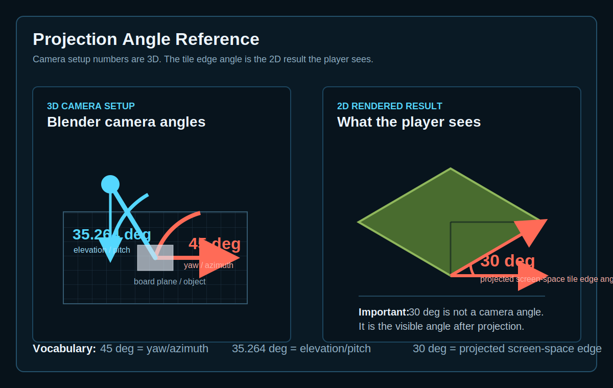

# Projection Angle Reference

This note defines the words we use when matching Blender-rendered units to the game board.

## Terms

- **Yaw / azimuth**: the camera's horizontal rotation around the board. A `45 deg` yaw means the camera looks from a board corner.
- **Elevation / pitch**: the camera's tilt above the board plane. In true isometric projection, this is `35.264 deg`.
- **Projected screen-space tile edge angle**: the visible angle of the rendered tile edge in the final 2D image. In true isometric projection, this is `30 deg`.

The important distinction: `30 deg` is not the Blender camera elevation. It is the visible 2D result after the 3D scene is projected into an image.
